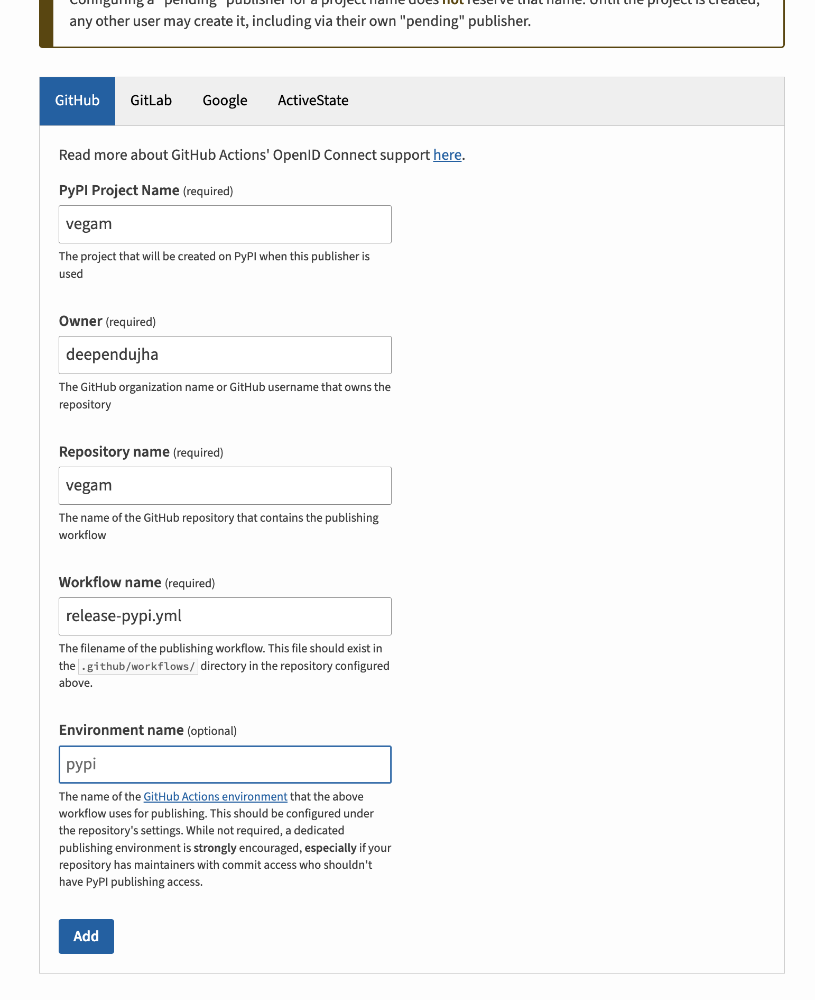

# Instructions for Publishing to PyPI

1. Visit [publishing](https://pypi.org/manage/account/publishing/) page on PyPI: https://pypi.org/manage/account/publishing/

2. Fill in details:

3. Use the workflow file [release-pypi.yml](./workflows/release-pypi.yml) to automate the release process. This workflow will be triggered when you create a new release on GitHub.
